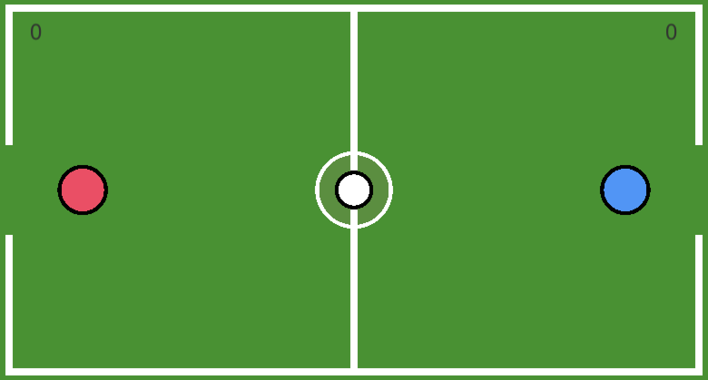
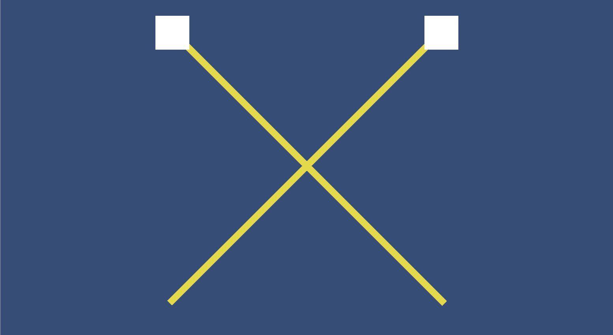
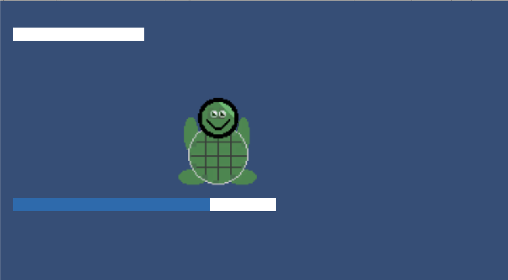
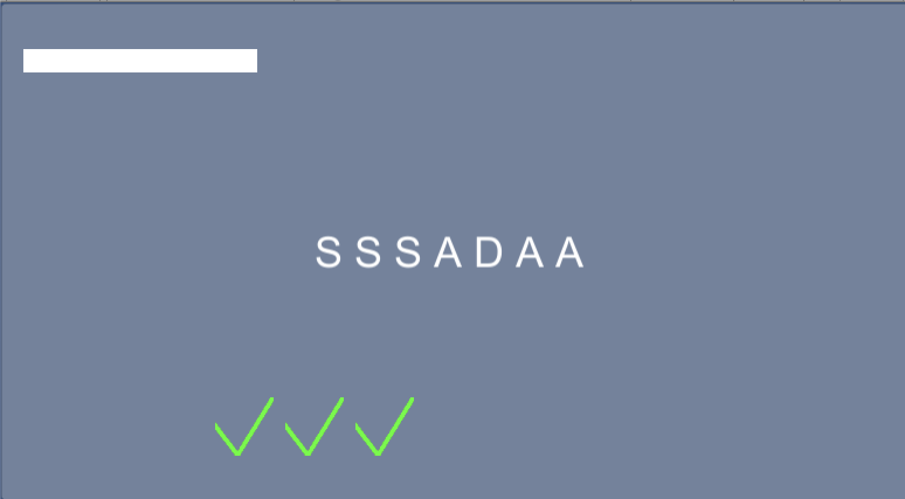
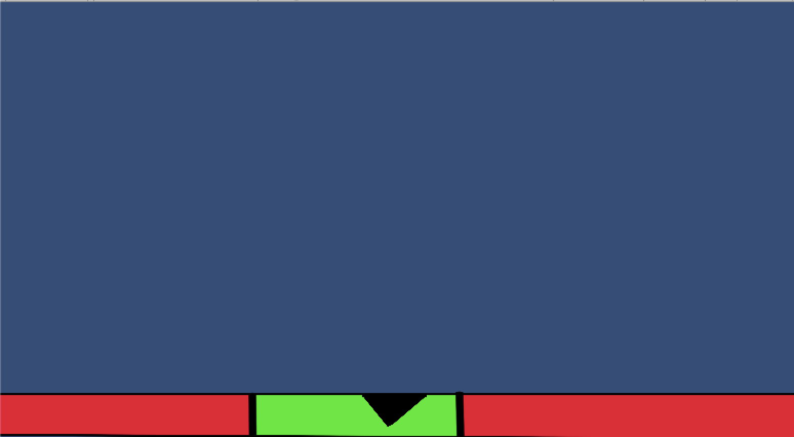
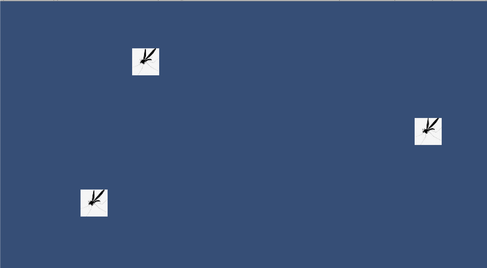

<a href="honu.exe" download></a>

# Table of contents

* [About](#about)
* [System Walkthrough](#system-walkthrough)
  * [Mini games](#mini-games)
  * [Duel Mode](#duel-mode)
* [Installation](#installation-instructions)
* [Application Design](#application-design)
  * [Directory Structure](#directory-structure)
* [Development History](#development-history)
  * [Phase 1: Minigames](#phase-1-minigames)
  * [Phase 2: Duel Mode](#phase-2-duel-mode)
* [Contact Us](#contact-us)


# About
Our EE 496 Capstone project is to create a game in Unity, a cross-platform game development engine used to build high quality 3D and 2D games.  We chose this project in order to gain experience designing a product that incorporates various aspects of game development including project management and machine learning.  Our objective is to learn how to design, produce, and release a product while also learning how to use popular tools, such as the Unity game engine, and programming languages, such as C#.  

[You can view the GitHub repo for our game here](https://github.com/EE-496/honu)

# System Walkthough
The main menu allows you to do one of the following: start game, start duel mode, turn background music on/off, and turn sound effects on/off.  The main menu also displays your high score!  

### Mini games

**Rules:**

When you start the game, you are presented with one of the following mini games:
* Make the poke bowl - drag the items into the bowl
* Reel in the fish - spin the wheel clockwise 5 times
* Hurricane proof the windows - drag the squares along the 'X' path
* Help the turtle swim - alternate pressing keys 'a' and 'd' to move back and forward
* Type the sequence - type out the random sequence of letters shown
* Chop the log - press the spacebar/click when the marker is over the green area
* Swat the flies - click all of the flies shown on the screen as they move around

As you play, you can view how much time you have left for a mini game by checking the progress bar.  

### Duel Mode



**Rules:**

The rules behind Duel Mode are similar to soccer. There exists two players that are trying to score goals by hitting a ball into the opponent’s goal. You are the red player and are trying the get the white ball into the goal on the right side of the field while also protecting the blue player from getting the ball in your goal on the left side of the field. 

# Installation Instructions
* [download a copy of the game](https://github.com/EE-496/honu) by cloning the repository using ```git clone``` and opening it in the Unity Game Engine to edit it, or <a href="honu.exe" download>download the executable file here</a>.

# Application Design

### Directory Structure
The directory structure contains:

```
Assets/
    music/
    prefabs/
    scenes/
    scripts/
    sprites/
docs/
honu_Data/        
Library/
Mono/
Packages/
ProjectSettins/
.gitignore 
```

# Development History

### Phase 1: Minigames
summer 2018 - present

We created a collection of minigames using various game mechanics in order to familiarize ourselves with the Unit Game Engine. 

The goals of Phase 1 included the following: 
* Create a set of short, consecutive minigames to familiarize ourselves with the Unity Game Engine

**List of minigames:**

* Make the poke bowl


* Reel in the fish


* Hurricane proof the windows



* Help the turtle swim



* Type the sequence



* Chop the log



* Swat the flies




### Phase 2: Duel Mode
fall 2018 - present

We created a player-versus-Agent duel-mode that allows the user to play soccer with a Unity Agent.  

The goals of Phase 2 included the following:
* Use Unity's Machine Learning Tools to create an Agent to play against the user

We started by constructing an arena, shown below, in which to train the agent. The rules behind Duel Mode are similar to soccer. There exists two players that are trying to score goals by hitting a ball into the opponent’s goal. This arena was designed to keep in the players as to restrict movement to only the play field. Once the arena was constructed, the machine learning aspect was added. Two training models were written, one for each potential player in the arena. The critical aspect of these training models are found in the AgentAction function. In this function, the rewards for each agent are calculated. In these models, rewards are based on how far away the player is to scoring, how far away the opponent is to scoring, how far away the player is to the ball, and if any goals were scored.  


By implementing a proper reward system, the machine learning agents are guided to behave in a certain manner to optimize rewards. Certain rewards, such as scoring a goal, are weighted more heavily to encourage more of a certain type of behavior. In order to train the model, several thousands of simulations are run in which the lifecycle of an agent is observed. A simulation will aggregate the results of the agent and store the training results in an output file. This output file will essentially store the “brain” of the agent so that the agent’s experiences can be later utilized in further trainings. This “brain” can be attached as a component onto other agents so that newly created agents can harness the experiences of older agents without the need to retrain the machine learning model. Once the “brain” has been created, the “brain” is attached to the opponent in the Duel Mode while the user controls the other player. The human user can now play against an agent that has several thousands of simulations in experience. If the agent is unable to perform adequately, the “brain” can be retrained under many more simulations until the desired behavior is achieved.


# Contact Us
* [Sean Teramae](https://github.com/kekupua) (CENG): teramae8@hawaii.edu
* [Riley Cammack](https://github.com/rcammack) (CENG): rcammack@hawaii.edu
* [Barry Abe](https://github.com/barryabe) (CENG): barryabe@hawaii.edu
